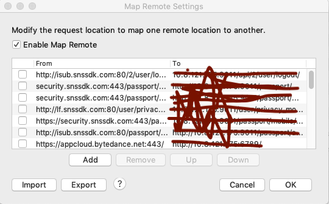
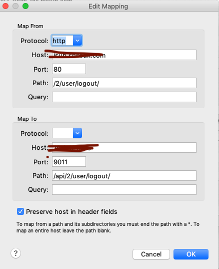
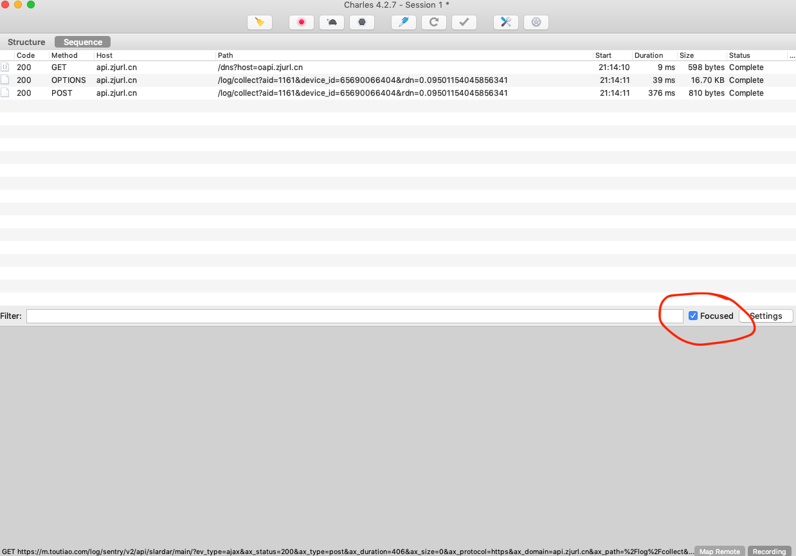
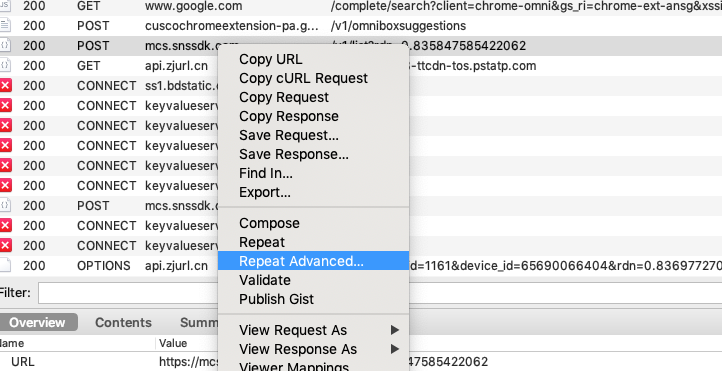
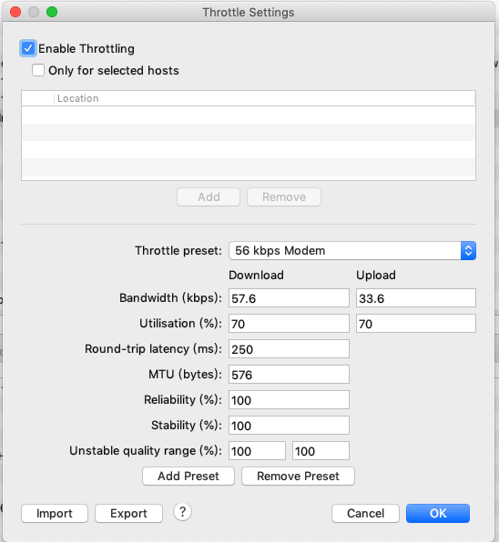

{:toc}

# 抓取客户端请求
使用客户端测试时，需要抓取客户端发出的请求。此时可以通过把手机的网络请求代理到pc端，通过Charles来抓取

## charles配置过程：
charles抓包流程：
1. 手机配置手动代理

2. charles开启mac代理

此时,通过手机发送的网络请求将会代理到配置的ip地址，同时由于charles监听了8888端口，所以charles可以获取到本机的网络请求

# 将本地请求代理到指定地址

Tools->Map Remote

* 路径支持部分匹配
* Host为空表示匹配所有域名下的路径
* 支持路径改写

Tools->Map Local
将网络请求转发到本地文件

# 过滤网络请求
在需要过滤的网络请求上，右键选择`Focus`,然后勾选下方的`Focused`,则只展示标注了`Focus`的请求。

# DNS修改
修改dns解析，也就是把域名解析到假的地址。也就是所说的DNS劫持。
Tools->DNS Spoofing

# 模拟请求
1. 压力测试
请求上右键，选择`Repeat Advanced`

2. 网络模拟
`Proxy`->`Throttle Setting`

# 缓存请求内容
//todo
# 请求重写
Rewrite
//todo