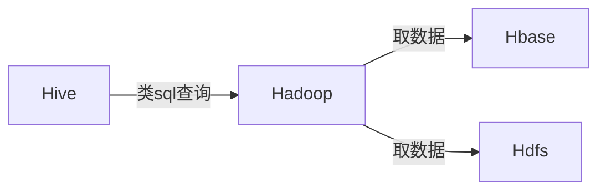

* TOC
{:toc}

上午查询hive表,同样的sql,一定几率出现执行失败的情况.看执行记录,发现搜索引擎标记Hive的都失败了,SparkCli和Spark都成功了.对这些相关名词比较陌生,理下相关概念和关系

```mermaid
graph LR
    A[Hive] -->|类sql查询| B[Hadoop]
    B[Hadoop] --> |取数据|C[Hbase]
    B[Hadoop] --> |取数据|D[Hdfs]
```
Hive:一个类sql的搜索引擎
Hadoop:一个处理大文件的分布式系统
Hbase:存储系统
Hdfs:存储系统

Spark
MapReduce
