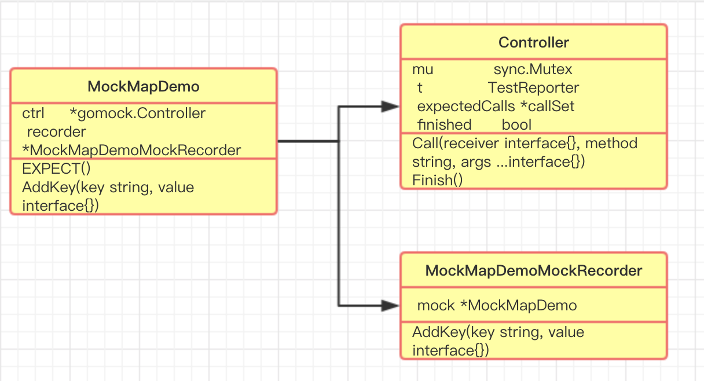

* TOC
{:toc}

# 使用
gomock是go官方自带的一个mock库.

1. 定义接口类`./basic/mapinit.go`
```
type MapDemoInterface interface {
	AddKey(key string, value interface{}) error
	UpdateKey(key string, value interface{}) error
	DeleteKey(key string) error
	QueryByKey(key string) (interface{}, error)
}
```
2. 通过`mockgen`命令生成mock类的代码`mockgen -source=./basic/mapinit.go -destination=./mock/mapinit.go`
3.  编写测试代码
```
func TestMapDemo(t *testing.T) {
	mockCtrl := gomock.NewController(t)
	defer mockCtrl.Finish()

	mockMapDemo := mock_basic.NewMockMapDemo(mockCtrl)

	//mockMapDemo.EXPECT().UpdateKey(gomock.Any(), gomock.Any()).Return(nil)
	mockMapDemo.EXPECT().AddKey(gomock.Any(), gomock.Any()).Return(nil)
	mockMapDemo.EXPECT().QueryByKey("smile").Do(func(key string) {
		fmt.Println("query fake smile")
	}).Return("=_=", nil)

	data := basic.GetSmile(mockMapDemo)
	fmt.Println(data)
	if data == "=_=" {
		t.Errorf("Expected =_=, got %d", data)
	}
}
```

# 相关类


`type Controller`:定义整个测试的行为,当一个测试运行结束,清理相关资源
`func NewController(t TestReporter) *Controller`
`func (ctrl *Controller) Finish()`:将本次的单测执行状态置为完成,同时检查所有期望执行的mock方法是否都被调用,调用是否成功,并输出错误信息

# 执行
## 数据准备
1. 初始化一个Controller和mock对象
```
	mockCtrl := gomock.NewController(t)
	defer mockCtrl.Finish()

	mockMapDemo := mock_basic.NewMockMapDemo(mockCtrl)
```
2. 定义mock方法
```
mockMapDemo.EXPECT().UpdateKey(gomock.Any(), gomock.Any()).Return(nil)
```
通过mockgen命令会生成两个类,如这里的`MockMapDemo`和`MockMapDemoMockRecorder`,通过EXPECT()方法获得`MockMapDemoMockRecorder`对象后,调动mockGen生成的AddKey方法,将会在Controller对象的expectedCalls中添加一个针对该方法调用的Call对象.
```
func (mr *MockMapDemoMockRecorder) AddKey(key, value interface{}) *gomock.Call {
	return mr.mock.ctrl.RecordCallWithMethodType(mr.mock, "AddKey", reflect.TypeOf((*MockMapDemo)(nil).AddKey), key, value)
}
func (ctrl *Controller) RecordCallWithMethodType(receiver interface{}, method string, methodType reflect.Type, args ...interface{}) *Call {
	if h, ok := ctrl.t.(testHelper); ok {
		h.Helper()
	}

	call := newCall(ctrl.t, receiver, method, methodType, args...)

	ctrl.mu.Lock()
	defer ctrl.mu.Unlock()
	ctrl.expectedCalls.Add(call)

	return call
}
```
## 调用mock方法
为了mock对象和方法能生效,需要显示通过set方法或对象传入的方式来指定mock对象.
如:`data := basic.GetSmile(mockMapDemo`

```
func (m *MockMapDemo) AddKey(key string, value interface{}) error {
	ret := m.ctrl.Call(m, "AddKey", key, value)
	ret0, _ := ret[0].(error)
	return ret0
}
```
Call方法检测expectedCalls中的预定义的mock行为,并取出指定的返回值返回.
## 执行结束
退出并打印单测运行信息
```
func (ctrl *Controller) Finish() {
	if h, ok := ctrl.t.(testHelper); ok {
		h.Helper()
	}

	ctrl.mu.Lock()
	defer ctrl.mu.Unlock()

	if ctrl.finished {
		ctrl.t.Fatalf("Controller.Finish was called more than once. It has to be called exactly once.")
	}
	ctrl.finished = true

	// If we're currently panicking, probably because this is a deferred call,
	// pass through the panic.
	if err := recover(); err != nil {
		panic(err)
	}

	// Check that all remaining expected calls are satisfied.
	failures := ctrl.expectedCalls.Failures()
	for _, call := range failures {
		ctrl.t.Errorf("missing call(s) to %v", call)
	}
	if len(failures) != 0 {
		ctrl.t.Fatalf("aborting test due to missing call(s)")
	}
}
```
Finish()方法首先将finished状态置为true,表示单测运行结束,然后检查expectedCalls的运行状态,打印运行信息
# 其他
1. mockgen只能针对接口生成mock代码,但是根据gomock的mock过程,即使mockMapDemo是结构体的子类,整个mock方法的调用过程也是没问题的.
2. 需要把mock对象通过set方法传递进去,对于通过New()生成的对象,可以使用gostub打桩,修改New方法的行为来修改返回值.
# 比较
1. GoMock是由Golang官方开发维护的测试框架，实现了较为完整的基于interface的Mock功能，能够与Golang内置的testing包良好集成，也能用于其它的测试环境中。GoMock测试框架包含了GoMock包和mockgen工具两部分，其中GoMock包完成对桩对象生命周期的管理，mockgen工具用来生成interface对应的Mock类源文件。


# 扩展
管理测试用例:[goconvey](http://goconvey.co/)
打桩:[gostub](https://github.com/prashantv/gostub),把Golang中想Mock的东西变成变量，然后对这个变量进行赋值仿造了
[官方文档](https://github.com/golang/mock)
